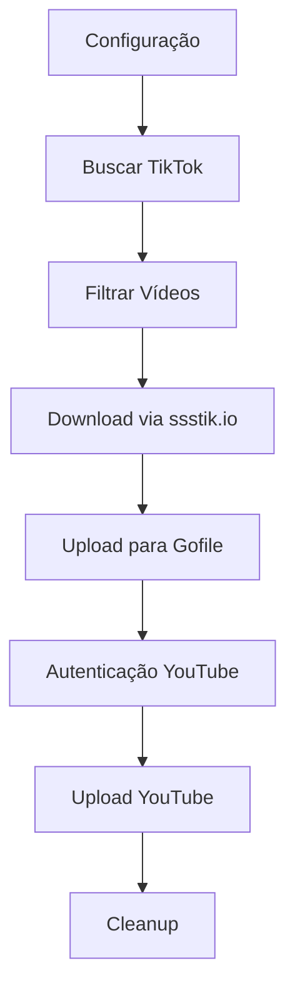
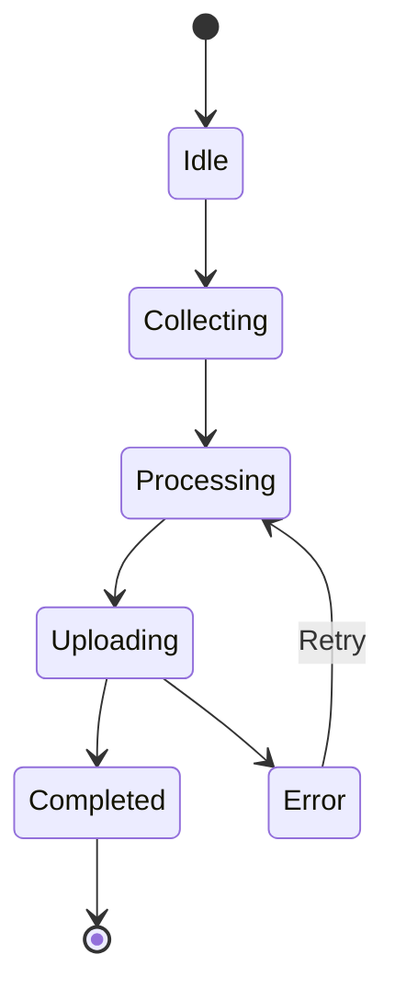

# TikTok to YouTube Automation System

## 🚀 Sistema Premium de Automação

Sistema completo para automatizar o fluxo de coleta de vídeos do TikTok, processamento e upload para YouTube com interface glassmorphic e logs detalhados.

## ✨ Características Principais

### 🎯 Funcionalidades Core
- **Coleta Automatizada**: Busca vídeos do TikTok por palavra-chave
- **Download sem Marca D'água**: Via ssstik.io
- **Armazenamento Temporário**: Upload para Gofile
- **Upload YouTube**: Com OAuth2 e metadados personalizados
- **Rate Limiting**: Inteligente e automático
- **Retry Logic**: Sistema robusto de tentativas
- **Logs Detalhados**: Monitoramento completo

### 🎨 Interface Premium
- **Design Glassmorphic**: Cards com efeito de vidro
- **Mobile-First**: Responsivo em todas as telas
- **Animações Suaves**: Transições e micro-interações
- **Dark Theme**: Tema escuro moderno
- **Progress Tracking**: Progresso em tempo real

### 🛡️ Segurança
- **Validação de Inputs**: Todos os dados são validados
- **Environment Variables**: Configuração segura
- **Rate Limiting**: Proteção contra sobrecarga
- **Error Handling**: Tratamento robusto de erros

## 🏗️ Arquitetura

### Componentes Principais

```
src/
├── components/
│   ├── automation/
│   │   ├── TikTokCollector.tsx      # Coleta de vídeos
│   │   ├── VideoProcessor.tsx       # Download e upload
│   │   └── YouTubeUploader.tsx      # Upload para YouTube
│   └── dashboard/
│       └── AutomationDashboard.tsx  # Interface principal
├── lib/
│   ├── services/
│   │   ├── tiktok-service.ts        # API TikTok
│   │   ├── gofile-service.ts        # API Gofile
│   │   └── youtube-service.ts       # API YouTube
│   ├── types/
│   │   └── automation.ts            # Tipos TypeScript
│   └── config/
│       └── environment.ts           # Configuração ENV
```

### Fluxo de Dados



### Estados e Progresso



## 🔧 Configuração

### Variáveis de Ambiente

```bash
# Gofile (Backend apenas)
GOFILE_ACCOUNT_ID=your_account_id
GOFILE_ACCOUNT_TOKEN=your_token

# YouTube OAuth2
YOUTUBE_CLIENT_ID=your_client_id
YOUTUBE_CLIENT_SECRET=your_client_secret  # Backend apenas
YOUTUBE_PROJECT_ID=your_project_id
YOUTUBE_AUTH_URI=https://accounts.google.com/o/oauth2/auth
YOUTUBE_TOKEN_URI=https://oauth2.googleapis.com/token
YOUTUBE_REDIRECT_URIS=http://localhost:8080/auth/callback

# TikTok (Se usar API oficial)
TIKTOK_CLIENT_KEY=your_client_key        # Backend apenas
TIKTOK_CLIENT_SECRET=your_client_secret  # Backend apenas
```

### Rate Limits

| Serviço | Limite | Burst |
|---------|--------|-------|
| TikTok  | 60/min | 10    |
| Gofile  | 30/min | 5     |
| YouTube | 100/min| 50/day|

## 🎮 Como Usar

### 1. Coleta de Vídeos
```typescript
// Configure palavra-chave e filtros
const config = {
  keyword: "receitas",
  videoCount: 10,
  filters: {
    minDuration: 15,
    maxDuration: 60,
    excludeKeywords: ["spam", "nsfw"]
  }
};
```

### 2. Processamento
```typescript
// Os vídeos são processados automaticamente:
// 1. Download via ssstik.io (sem marca d'água)
// 2. Upload para Gofile (armazenamento temporário)
// 3. Rate limiting automático
// 4. Retry em caso de erro
```

### 3. Upload YouTube
```typescript
// Configure metadados do canal
const youtubeConfig = {
  title: "Meu Canal",
  description: "Conteúdo viral do TikTok",
  tags: ["viral", "tiktok", "trending"],
  category: "Entertainment",
  privacy: "public"
};
```

## 🔄 Sistema de Logs

Todos os logs seguem o padrão:
```typescript
console.log('[AutomationSystem]', 'mensagem', dados);
```

### Tipos de Log
- **Info**: Operações normais
- **Warning**: Situações de atenção
- **Error**: Erros capturados
- **Debug**: Informações detalhadas

## 🛠️ Desenvolvimento

### Estrutura de Componentes

Cada componente segue o padrão:
- **Props Interface**: Tipos bem definidos
- **State Management**: Estados locais e callbacks
- **Error Handling**: Tratamento robusto
- **Loading States**: Estados de carregamento
- **Responsive Design**: Mobile-first

### Design System

```css
/* Cores principais */
--primary: 262 83% 58%;           /* Roxo vibrante */
--primary-glow: 262 83% 70%;      /* Roxo mais claro */
--background: 220 13% 9%;         /* Fundo escuro */

/* Efeitos glassmorphic */
--glass-bg: 220 13% 11% / 0.8;
--glass-border: 262 83% 58% / 0.2;
--glass-shadow: 262 83% 30% / 0.3;
```

### Animações

```css
/* Transições suaves */
.transition-glass { 
  transition: all 0.3s cubic-bezier(0.4, 0, 0.2, 1); 
}

/* Animações de carregamento */
.animate-processing { 
  animation: processing 1s linear infinite; 
}

/* Efeitos de entrada */
.animate-slide-up { 
  animation: slide-up 0.3s ease-out; 
}
```

## 🚨 Considerações de Segurança

### ⚠️ CRÍTICO: Nunca Expor no Frontend
- Tokens de API
- Client Secrets
- Account IDs sensíveis
- Chaves privadas

### ✅ Seguro para Frontend
- Client IDs públicos
- URLs de redirecionamento
- Configurações de UI
- Estados de progresso

### 🔐 Implementação Recomendada

Para produção, implemente:

1. **Backend Service**: API própria para gerenciar secrets
2. **OAuth Proxy**: Serviço para lidar com autenticação
3. **Rate Limiting**: Implementação server-side
4. **Validation**: Validação dupla (frontend + backend)

## 📊 Monitoramento

### Métricas Importantes
- Taxa de sucesso na coleta
- Tempo médio de processamento
- Erros por tipo de serviço
- Uso de rate limits
- Performance do upload

### Alertas Recomendados
- Rate limit atingido
- Falhas consecutivas > 3
- Tempo de processamento > 5min
- Erros de autenticação

## 🎯 Melhorias Futuras

### Curto Prazo
- [ ] Suporte a múltiplas contas YouTube
- [ ] Preview de vídeos antes do upload
- [ ] Agendamento de uploads
- [ ] Dashboard de analytics

### Médio Prazo
- [ ] Integração com mais plataformas
- [ ] IA para otimização de metadados
- [ ] Sistema de templates
- [ ] Backup automático

### Longo Prazo
- [ ] Machine Learning para curadoria
- [ ] API pública do sistema
- [ ] Marketplace de templates
- [ ] Integração com ferramentas de edição

## 🆘 Troubleshooting

### Problemas Comuns

**Rate Limit Atingido**
```typescript
// Sistema faz retry automático
// Aguarde o reset (1 minuto)
```

**Falha na Autenticação YouTube**
```typescript
// Verifique as credenciais OAuth2
// Confirme URLs de redirecionamento
```

**Erro no Download TikTok**
```typescript
// Verifique conectividade com ssstik.io
// URL do vídeo pode estar inválida
```

### Debug Mode

Para ativar logs detalhados:
```typescript
localStorage.setItem('automation-debug', 'true');
```

## 📋 Checklist de Deploy

- [ ] Variáveis de ambiente configuradas
- [ ] Rate limits testados
- [ ] OAuth2 funcionando
- [ ] Error handling validado
- [ ] Performance otimizada
- [ ] Logs configurados
- [ ] Monitoramento ativo
- [ ] Backup implementado

---

**Desenvolvido com ❤️ usando React, TypeScript e shadcn/ui**